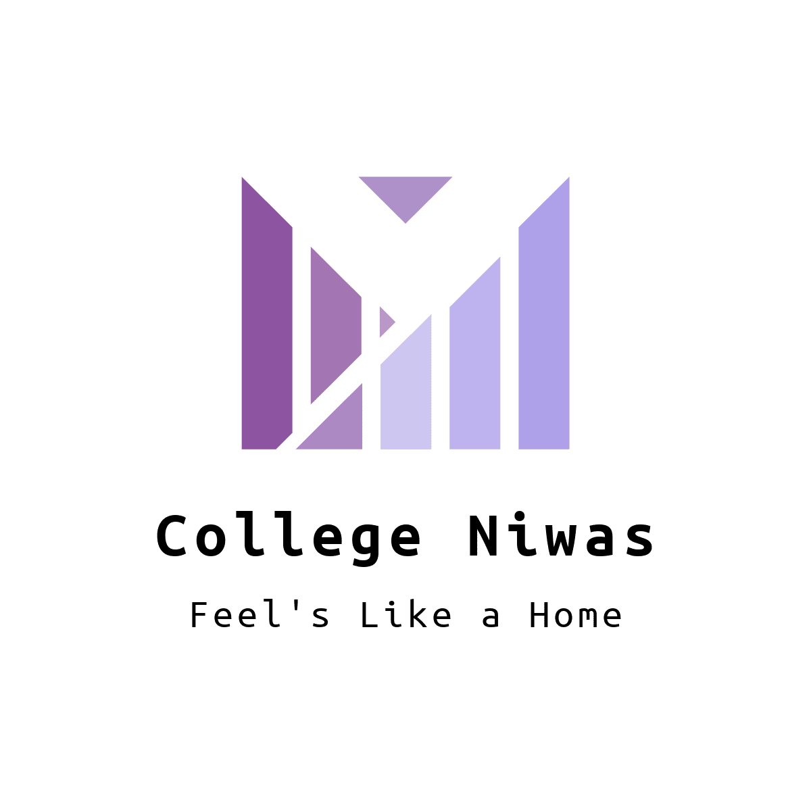
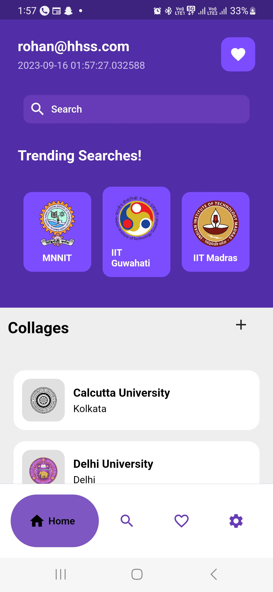
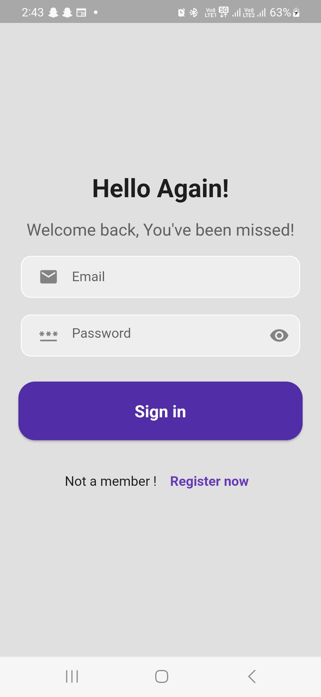
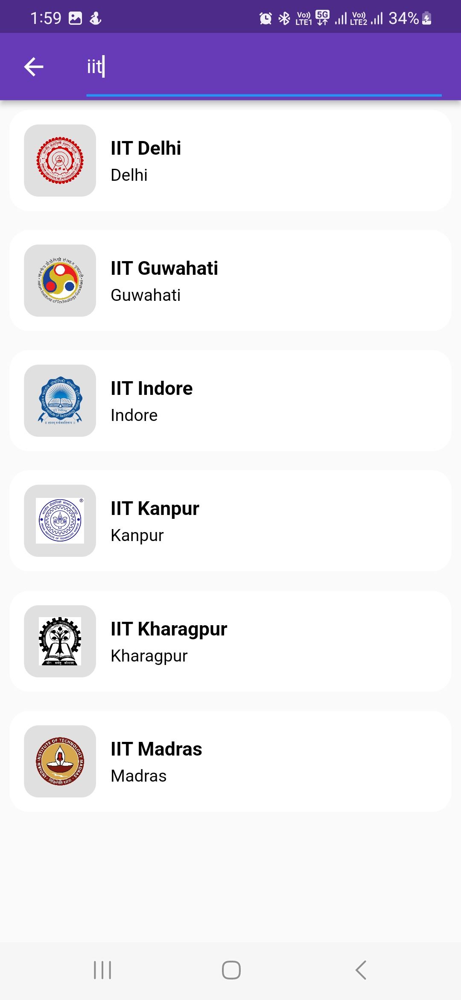

# College Niwas - Flutter App




## Description

College Niwas is an Android app designed to help college students find and list rooms and PG accommodations near their respective colleges. It simplifies the process of searching for suitable accommodations and enables students to book visits to the listed PGs and rooms. Additionally, the app offers a separate admin dashboard for PG and room owners, allowing them to manage their listings.

## Features

### For Students

- **Search Accommodations**: Users can search for rooms and PGs near their college by specifying their college name or location.

- **View Listings**: Detailed listings of available accommodations, including descriptions, photos, prices, and contact information.

- **Book Visits**: Students can book visits to view the accommodations they are interested in.

- **Filter Options**: Filter search results based on preferences such as budget, location, and amenities.

### For PG/Room Owners (Admin Dashboard)

- **Manage Listings**: PG and room owners can create, edit, and delete listings for their accommodations.

- **View Booking Requests**: Owners can view and accept/reject booking requests from students.

- **Update Availability**: Owners can update the availability status of their accommodations.

## Screenshots







## Installation

1. Clone the repository:

   ```bash
   git clone https://github.com/rohan-algorithm/DevjamPGFinal.git


Contact
If you have any questions or need assistance, feel free to contact us at rohanrao543211@gmail.com.   
